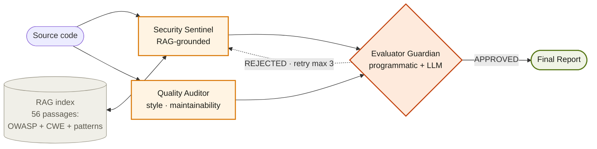

# CodeSentinel

> A multi-agent, retrieval-augmented AI system for automated code review and vulnerability detection. **Same Claude Sonnet model, same prompts, different architecture: 97% reduction in hallucinated findings.**

[](https://aravindb98.github.io/CodeSentinel/#source)
[](https://codesentinel-f2ggdvqeuwsj4pta5sk27s.streamlit.app)
[-c2410c?style=flat-square&logo=youtube)](https://youtu.be/do8GvAK7tHI)
[-d97706?style=flat-square)](./docs/CodeSentinel_Technical_Report.pdf)
[](./tests/)
[](./LICENSE)

**Author:** Aravind Balaji · M.S. Information Systems · Northeastern University
**Course:** INFO 7375 (Prompt Engineering and Generative AI) · Spring 2026 · Prof. Nik Bear Brown
**Contact:** balaji.ara@northeastern.edu · NUID: 001564773

---

## Introduction

Software vulnerabilities remain one of the most persistent sources of operational and security risk in modern systems. The OWASP Top 10 — first published in 2003 — has been dominated by the same categories for two decades: injection, broken access control, insecure deserialization, cryptographic failures. Not because they are unknown. Because code review at scale is expensive, inconsistent, and fatiguing for humans, and because the volume of code shipped per engineer per day has grown far faster than the population of trained security reviewers.

Large language models have become competent code reviewers. A single prompt to a capable LLM can identify many of the same defects a trained human would, in seconds rather than hours. But in practice, the naive deployment of a single LLM call for code review produces an output with three structural weaknesses: **findings are ungrounded** (the model can invent plausible-sounding vulnerabilities that don't exist), **output is monolithic** (no internal adversary challenges any claim, so false positives flow through at the same rate as true ones), and **errors are untraceable** (no record of what the model knew or what alternatives were considered).

CodeSentinel closes all three failure modes architecturally rather than by writing a better prompt.

---

## What is CodeSentinel

CodeSentinel is a three-agent system built on LangGraph that performs RAG-grounded, adversarially-validated code review. Every security finding it emits has three properties you can verify at the Evaluator boundary before it reaches the user:

- **It is specialized.** Each agent has a narrow mandate — one for security, one for code quality, one for adversarial review. No agent does everything.
- **It is grounded.** Every security claim must cite a retrieved passage from a 56-passage knowledge base built from OWASP Top 10 2025, CWE taxonomy, and language-specific patterns. Findings without citations are rejected programmatically before they reach the user.
- **It is adversarially reviewed.** A dedicated Evaluator Guardian runs a two-layer check on every finding — first a programmatic validation (citation present, fix length ≥ 20 chars, confidence ≥ 0.5, schema valid), then an LLM semantic check (does the cited passage actually support the claim). If either layer fails, the finding is rejected with structured feedback and the upstream agent gets three retries before a circuit breaker terminates.

The architecture compounds in a way that a better prompt cannot. On April 20, 2026, evaluated against a 10-sample hand-labeled toy suite with real Claude Sonnet, the single-prompt baseline produced **30 false positives** (an average of three hallucinated findings per sample). The multi-agent CodeSentinel pipeline produced **1**. Same model. Same prompts to the LLM. Same samples. **A 97% reduction in hallucinated findings, attributable purely to the architecture.**

---

## Why have it

Three specific reasons a team might deploy this pattern rather than a single-prompt LLM reviewer:

- **Because hallucinations kill trust.** A code review tool that flags thirty false positives per ten files gets ignored by developers after the first week. The Evaluator Guardian's citation-required policy is the structural defense against the single failure mode that causes LLM tools to be abandoned in production.

- **Because findings need provenance.** When the Security Sentinel says "line 47 is CWE-502 pickle deserialization," it cites the specific passage in the RAG corpus that defines that weakness. A reviewer can trace the claim back to OWASP or CWE in one click. For regulated industries this is not optional, and for everyone else it is a quality-of-life improvement that reduces the triage burden by orders of magnitude.

- **Because the architecture composes with any model.** The 97% number is specifically about Claude Sonnet in April 2026. The architectural pattern — specialize, ground, adversarially review — is what Anthropic's Project Glasswing uses at industrial scale with the same class of model to find zero-day vulnerabilities in operating systems and web browsers. Swapping Claude Sonnet for a stronger model would improve the raw detection numbers without requiring any architectural change. That is the point of the pattern.

The contribution this project makes is not a new model. It is a demonstration that the specialize-ground-adversarially-review pattern is reproducible, testable, and teachable with open tools at the scale of an academic course project, and that its gains are attributable to the architecture rather than to whatever model happens to sit underneath.

---

## Links

| Artifact | URL |
|---|---|
| 🌐 **Project website** | https://aravindb98.github.io/CodeSentinel/#source |
| 🧪 **Live Streamlit demo** | https://codesentinel-f2ggdvqeuwsj4pta5sk27s.streamlit.app |
| 🎬 **Video walkthrough (7 min)** | https://youtu.be/do8GvAK7tHI |
| 📦 **GitHub repository** | https://github.com/AravindB98/CodeSentinel |
| 📄 **Technical report** (46 pages) | [`docs/CodeSentinel_Technical_Report.pdf`](./docs/CodeSentinel_Technical_Report.pdf) |
| 🏛 **Architecture doc** | [`docs/ARCHITECTURE.md`](./docs/ARCHITECTURE.md) |

---

## The headline number

| System                    | TPR   | FPR   | False positives | CWE accuracy |
|---------------------------|-------|-------|-----------------|--------------|
| Single-prompt baseline    | 1.000 | 0.789 | **30**          | 1.000        |
| Multi-agent CodeSentinel  | 1.000 | 0.111 | **1**           | 1.000        |
| **Δ (multi − baseline)**  | 0.000 | **−0.678** | **−29 (−97%)** | 0.000      |

Measured on April 20, 2026 with real Claude Sonnet against a 10-sample hand-labeled toy suite. Same model, same prompts to the LLM, same samples — the 97% reduction is attributable purely to the architecture. See §10.4.1 of the technical report for raw results at `eval/results/20260420_143220/`.

Paired-suite (20 samples, OWASP-Benchmark-style): **McNemar's exact p = 0.0312** (significant at α = 0.05). Youden index: +0.818 multi-agent vs −0.238 baseline.

---

## How to run it

### Quick start (no API key — mock mode)

```bash
git clone https://github.com/AravindB98/CodeSentinel.git
cd CodeSentinel
pip install -r requirements.txt
make ingest           # build ChromaDB from rag/data/
make benchmark        # deterministic mock-mode benchmark
make test             # all 35 unit tests
```

### Real LLM (requires Anthropic API key)

```bash
export ANTHROPIC_API_KEY=sk-ant-...
unset CODESENTINEL_MOCK_LLM
make benchmark        # runs against Claude Sonnet, ~$2 for full toy suite
```

### Streamlit UI (local)

```bash
streamlit run app/streamlit_app.py
# or visit the live deployment:
# https://codesentinel-f2ggdvqeuwsj4pta5sk27s.streamlit.app
```

---

## Architecture at a glance



Full engineering reference: [`docs/ARCHITECTURE.md`](./docs/ARCHITECTURE.md).

---

## Repository structure

```
CodeSentinel/
├── .github/workflows/
│   └── deploy.yml                        # GitHub Pages deployment workflow
├── app/
│   └── streamlit_app.py                  # Live demo UI (also deployed on Streamlit Cloud)
├── graph/                                # LangGraph orchestration
│   ├── state.py                          #   shared TypedDict state
│   ├── schemas.py                        #   Pydantic + dataclass fallback
│   ├── build_graph.py                    #   LangGraph wiring + fallback runner
│   ├── agents/
│   │   ├── security_sentinel.py
│   │   ├── code_quality_auditor.py
│   │   └── evaluator_guardian.py
│   └── prompts/
│       ├── security.md                   #   versioned system prompts
│       ├── quality.md
│       └── evaluator.md
├── rag/                                  # Retrieval pipeline
│   ├── ingest.py                         #   triple-backend ingest (ChromaDB → TF-IDF → pure Python)
│   ├── retriever.py                      #   two-pass retrieval with lexical rerank
│   └── data/
│       ├── owasp_top10_2025.txt          #   10 OWASP Top 10 2025 entries
│       ├── cwe_subset.csv                #   29 CWE taxonomy entries
│       └── patterns.md                   #   17 language-specific patterns
├── synth/                                # Synthetic data generation (15 CWE templates)
│   ├── generate.py
│   ├── verify.py                         #   independent regex-based verifier
│   └── templates/
├── rl/                                   # RL modules (NOT wired into graph)
│   ├── bandit.py                         #   UCB-1 contextual bandit
│   └── policy.py                         #   REINFORCE policy gradient
├── eval/                                 # Benchmark harness
│   ├── baseline_single_prompt.py
│   ├── run_benchmark.py
│   ├── semgrep_compare.py
│   ├── datasets/
│   │   ├── toy_suite.json                #   10 hand-labeled samples
│   │   ├── paired_suite.json             #   20 OWASP-Benchmark-style
│   │   └── synthetic_suite.json          #   29 verified synthetic
│   └── results/
│       ├── 20260420_143220/              #   Real Claude Sonnet run · April 20, 2026
│       ├── toy_suite_10sample/           #   Mock-mode benchmark output
│       ├── paired_suite_20sample/        #   Mock-mode paired output
│       └── semgrep_comparison/           #   Semgrep vs CodeSentinel (Flask source)
├── utils/
│   └── llm_client.py                     # Anthropic SDK + deterministic mock
├── tests/                                # 35 unit tests (pytest-optional)
│   ├── test_rag.py
│   ├── test_agents.py
│   └── test_pipeline.py
├── website/
│   └── index.html                        # Project showcase page (deployed via Pages)
├── docs/
│   ├── ARCHITECTURE.md                   # Engineering architecture doc
│   └── CodeSentinel_Technical_Report.pdf # 46-page technical report
├── requirements.txt
├── Makefile
├── .env.example
├── .gitignore
├── LICENSE
└── README.md                             # (this file)
```

---

## Technology stack

| Component              | Technology                                                  |
|------------------------|-------------------------------------------------------------|
| Agent orchestration    | LangGraph with hand-rolled fallback runner                  |
| Reasoning LLM          | Anthropic Claude Sonnet via official SDK + deterministic mock |
| Embeddings             | HuggingFace all-MiniLM-L6-v2 · local CPU · 384-dim          |
| Vector store           | ChromaDB persistent with TF-IDF fallback (triple-tier)      |
| User interface         | Streamlit (paste / upload, tabs for findings / evaluator / RAG / trace) |
| Schemas                | Pydantic 2 with dataclass-based fallback                    |
| RL                     | NumPy-only (torch optional but unused)                      |
| Testing                | 35 unit tests · unittest-compatible · pytest-optional       |
| Deployment             | Streamlit Community Cloud · GitHub Pages (for `website/`)   |

---

## Reproducing the results

### Mock mode (deterministic, no API key, runs in under a second)

```bash
export CODESENTINEL_MOCK_LLM=1
python -m eval.run_benchmark
# outputs: eval/results/<timestamp>/summary.md
```

### Real Claude Sonnet mode (~$2 for toy suite)

```bash
export ANTHROPIC_API_KEY=sk-ant-...
unset CODESENTINEL_MOCK_LLM
python -m eval.run_benchmark
```

### Semgrep comparison

```bash
pip install semgrep
python -m eval.semgrep_compare --target path/to/repo
```

---

## License

MIT. See [LICENSE](./LICENSE).

## Acknowledgments

Developed under the supervision of **Prof. Nik Bear Brown** at Northeastern University. The architectural pattern (specialize · ground · adversarially validate) mirrors the approach Anthropic's Project Glasswing applies at industrial scale; the contribution of this project is demonstrating that the pattern is reproducible, testable, and teachable with open tools at the scale of an academic course project.
