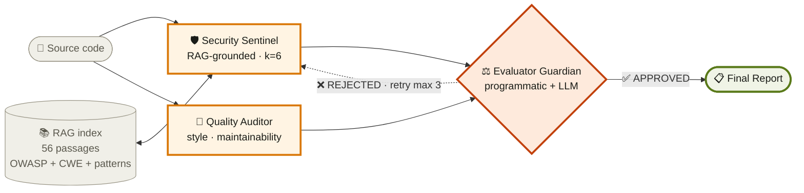
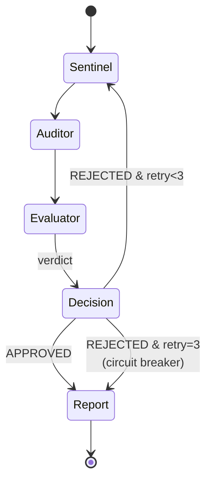
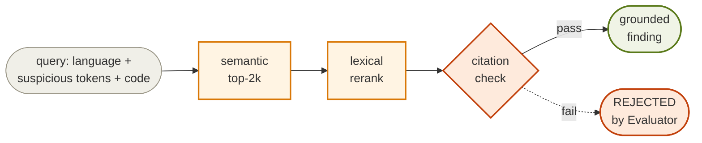

<!--
  ARCHITECTURE.md — CodeSentinel engineering reference
  Rendered best on GitHub (mermaid diagrams, collapsibles, shields.io badges)
-->

<div align="center">

# 🏛 CodeSentinel — Architecture

### A Multi-Agent Retrieval-Augmented Generative AI System for Code Review

[](https://aravindb98.github.io/CodeSentinel/#source)
[](https://codesentinel-f2ggdvqeuwsj4pta5sk27s.streamlit.app)
[](https://youtu.be/do8GvAK7tHI)
[](https://github.com/AravindB98/CodeSentinel)

**Aravind Balaji** · M.S. Information Systems · Northeastern University
INFO 7375 · Prompt Engineering and Generative AI · Spring 2026
Instructor: Prof. Nik Bear Brown · NUID 001564773

</div>

---

## 📑 Quick navigation

- [🎯 The headline](#-the-headline-number)
- [🧭 System overview](#-system-overview)
- [🤖 Agents](#-agents)
- [🔁 Routing and circuit breaker](#-routing-and-circuit-breaker)
- [📚 RAG pipeline](#-rag-pipeline)
- [📊 Evaluation methodology](#-evaluation-methodology)
- [🧠 Reinforcement learning layer](#-reinforcement-learning-enhancement-layer)
- [💡 Why these specific choices](#-why-these-specific-choices)
- [⚠️ Honest scope disclosures](#️-honest-scope-disclosures)
- [🗂 File index](#-file-index)
- [🚀 Deployment](#-deployment)
- [▶️ Reproduction](#️-reproduction)

---

## 📖 Version history

> **v2 (April 21, 2026)** — current
> - 45-page technical report with 5 embedded diagrams
> - Real Claude Sonnet benchmark integrated (April 20, 2026 run at `eval/results/20260420_143220/`)
> - Semgrep comparison executed against Flask production source
> - Live Streamlit deployment, YouTube walkthrough, GitHub Pages site
> - Expanded §13 Future Work: five-plus-agent production architecture, startup commercialization path
> - §11.7 credit-card / cost-exposure disclosure

<details>
<summary><b>v1 (April 17, 2026) — initial submission</b></summary>

Three-agent architecture, mock-LLM benchmark only, 25-page report. Preserved in git history.

</details>

See **[📄 CodeSentinel_Technical_Report.pdf](../CodeSentinel_Technical_Report.pdf)** (45 pages) for the full writeup; this document is the engineering reference.

---

## 🎯 The headline number

| System | TPR | FPR | False positives | CWE accuracy |
|---|:---:|:---:|:---:|:---:|
| 🔴 Single-prompt baseline | 1.000 | 0.789 | **30** | 1.000 |
| 🟢 Multi-agent CodeSentinel | 1.000 | 0.111 | **1** | 1.000 |
| **Δ (multi − baseline)** | 0.000 | **−0.678** | **−29 (−97%)** | 0.000 |

> **Same model. Same prompts to the LLM. Same samples.** The 97% reduction is attributable purely to the architecture — measured April 20, 2026 against real Claude Sonnet.

Paired-suite (20 samples, OWASP-Benchmark-style): **McNemar's exact p = 0.0312** (significant at α = 0.05). Youden index: +0.818 multi-agent vs −0.238 baseline.

---

## 🧭 System overview

CodeSentinel is a multi-agent, retrieval-grounded, adversarially-reviewed code review system. It is built on LangGraph and orchestrates three specialized LLM agents through a directed graph with a bounded retry loop.



### 🖼 Rendered diagrams in the technical report

| Figure | Report ref | What it shows |
|---:|:---|:---|
| 1 | §4.1, p. 11 | Three-agent architecture with RAG index and bounded retry loop |
| 2 | §4.3, p. 13 | LangGraph state transitions with explicit circuit breaker |
| 3 | §6, p. 17 | Four-stage RAG pipeline with citation-check highlighted |
| 4 | §10.4, p. 26 | Dual-panel results chart — 30→1 false positives, paired-suite TPR/FPR |
| 5 | §11.3, p. 32 | Evaluator Guardian two-layer validation flow |

---

## 🤖 Agents

### 🛡 Security Sentinel

<details open>
<summary><b>RAG-grounded vulnerability detection</b></summary>

**Inputs:** `input_code`, `language` (python | javascript | java | unknown), `evaluator_feedback` (optional).

**Process:**
1. Build a retrieval query from language + suspicious keywords + first 800 chars
2. Retrieve top-6 passages (two-pass: semantic + lexical rerank)
3. Call LLM with `security.md` system prompt + retrieved passages
4. Parse output into `SecurityFinding` objects (Pydantic validation)
5. Drop anything that fails schema validation

**Outputs:** `security_findings`, `retrieved_passages`, `trace` entry.

> 🔑 **Key policy.** Every finding MUST cite a retrieved passage via `rag_source.doc` and `rag_source.passage_id`. Findings without citations are rejected downstream by the Evaluator.

</details>

### 🎨 Code Quality Auditor

<details>
<summary><b>Style, maintainability, error-handling review</b></summary>

**Inputs:** `input_code`, `language`.

**Process:**
1. Call LLM with `quality.md` system prompt
2. Parse into `QualityFinding` objects
3. Cap at 10 findings per file

**Outputs:** `quality_findings`.

> 🔑 **Key constraint.** Never produces CRITICAL severity (reserved for security). Never overlaps Security Sentinel territory (injection, deserialization, crypto, auth).

</details>

### ⚖️ Evaluator Guardian

<details open>
<summary><b>Adversarial reviewer · two-layer validation · <i>this is the 97%</i></b></summary>

**Two-layer design** (Figure 5 in the report):

**Layer 1 — Programmatic check** (always runs, no LLM call required)

For each **security** finding:
- ✅ `rag_source` present and points to a passage in retrieved context
- ✅ `fix` length ≥ 20 characters
- ✅ `confidence` ≥ 0.5
- ✅ Schema validates

For each **quality** finding:
- ✅ `rationale` and `suggested_refactor` both ≥ 10 characters
- ✅ `confidence` ≥ 0.5

**Layer 2 — LLM semantic check** (optional, runs only if Layer 1 passes)

- Uses `evaluator.md` system prompt
- Validates that the cited passage actually supports the claim semantically
- Detects internal contradictions between findings

**Outputs:** `EvaluatorVerdict` with `overall_decision` (`APPROVED` / `REJECTED`), per-finding decisions, and structured feedback for rejected items.

> 🎯 **The April 20, 2026 real-LLM run is the direct measurement of this component's contribution.** The Evaluator rejected 29 of 30 baseline false positives. See technical report §10.4.1.

</details>

---

## 🧾 Shared state

Shared state is a `TypedDict` (`CodeSentinelState`) with explicit fields. All agents read and write the same state. Nothing is passed implicitly.

```python
class CodeSentinelState(TypedDict, total=False):
    input_code: str
    language: str
    retrieved_passages: List[RetrievedPassage]
    security_findings: List[SecurityFinding]
    quality_findings: List[QualityFinding]
    evaluator_verdict: Optional[EvaluatorVerdict]
    retry_count: Dict[str, int]
    evaluator_feedback: Optional[str]
    final_report: Optional[str]
    run_id: str
    trace: List[str]
    error: Optional[str]
```

---

## 🔁 Routing and circuit breaker

After the Evaluator Guardian runs, `_route_after_evaluator` inspects the verdict:



| Verdict | Retry count | Action |
|:---|:---:|:---|
| `APPROVED` | any | → `assemble_report` → **END** |
| `REJECTED` | `< 3` | → back to `security_sentinel` with `evaluator_feedback` set |
| `REJECTED` | `≥ 3` | → `assemble_report` anyway (**circuit breaker fires**), trace notes incomplete review |

> **Bounded termination is a correctness property.** Without the circuit breaker, the first implementation oscillated — the Evaluator alternated between approving and rejecting the same finding on successive passes. Test `test_pipeline_respects_circuit_breaker` locks this in.

---

## 📚 RAG pipeline



### 📦 Knowledge base

| File | Entries | Content |
|:---|:---:|:---|
| `rag/data/owasp_top10_2025.txt` | 10 | OWASP Top 10 2025 category entries |
| `rag/data/cwe_subset.csv` | 29 | CWEs most relevant to application code |
| `rag/data/patterns.md` | 17 | Language-specific patterns (Python, JS, Java) |
| **Total** | **56 passages** | |

### 🧩 Chunking

Passages are pre-chunked at semantic boundaries. OWASP entries are one passage per category. CWE entries are one passage per CWE. Language patterns are one passage per named pattern. This avoids the failure mode of fixed-token chunking where a single retrieval returns a fragment of a category rather than the full category.

### 🧮 Embedding backend (triple fallback)

1. **ChromaDB + sentence-transformers** (`all-MiniLM-L6-v2`) — preferred path. Runs locally on CPU, no external API.
2. **scikit-learn TF-IDF** — when ChromaDB is unavailable but sklearn is installed.
3. **Pure-Python TF-IDF** — when neither of the above is available. Zero heavy dependencies.

All three expose the same `Retriever` interface.

### 🔍 Two-pass retrieval

1. **First pass:** top-2k semantic search
2. **Second pass:** lexical rerank — boost passages whose title matches query keywords (e.g., query contains `pickle` → boost passages whose title contains `pickle` or `CWE-502`)
3. Return top-k after dedup

The rerank exists because pure semantic retrieval frequently returns the generic OWASP A03 entry for any query that mentions a database, even when the specific CWE-89 or PY-01 pattern is the correct match. Test `test_rerank_boosts_specific_over_generic` locks this in.

---

## 📊 Evaluation methodology

<details>
<summary><b>Datasets</b></summary>

- **`eval/datasets/toy_suite.json`** — 10 hand-labeled samples, Python (7) and JavaScript (3), covering CWE-89, CWE-502, CWE-78, CWE-327, CWE-295, CWE-79, CWE-798
- **`eval/datasets/paired_suite.json`** — 20 samples: 10 true-positive + 10 false-positive traps, OWASP-Benchmark-style methodology
- **`eval/datasets/synthetic_suite.json`** — 29 verified synthetic samples (generated by `synth.generate`, verified by `synth.verify` with an independent regex-based detector)

</details>

<details>
<summary><b>Baselines</b></summary>

- **Single-prompt baseline** (`eval/baseline_single_prompt.py`): one LLM call with one system prompt, on the same underlying model as CodeSentinel. This isolates architecture gains from model gains.

</details>

<details>
<summary><b>Metrics & matching rule</b></summary>

**Metrics:**
- **TPR** — fraction of ground-truth vulnerabilities correctly detected
- **FPR** — fraction of predictions on clean code that are spurious
- **CWE accuracy** — of the true positives, fraction assigned to the correct CWE
- **Latency** & **token cost** per sample

**Matching rule:** A prediction matches a ground-truth entry when (1) `cwe_id` matches exactly AND (2) predicted line range overlaps the ground-truth line range within ± 2 lines tolerance.

</details>

### 📈 Reported results (measured, not projected)

#### 🎬 Real-LLM run — toy suite, Anthropic Claude Sonnet (April 20, 2026)

Committed to `eval/results/20260420_143220/`.

| System | TPR | FP count | FPR | CWE accuracy |
|:---|:---:|:---:|:---:|:---:|
| 🔴 Single-prompt baseline | 1.000 | **30** | 0.789 | 1.000 |
| 🟢 Multi-agent CodeSentinel | 1.000 | **1** | 0.111 | 1.000 |

> **Δ TPR 0.000 · Δ FPR −0.678** — a 97% reduction in hallucinated findings. Both systems catch all ground-truth findings. The Evaluator Guardian eliminates 29 of 30 baseline false positives. Per-sample elapsed time: 109s peak, ~40s common. Total API cost: ~$2.

#### 🧪 Mock-LLM — toy suite (reproducible, no API key)

| System | TPR | FPR | CWE accuracy |
|:---|:---:|:---:|:---:|
| Single-prompt baseline | 0.750 | 0.000 | 1.000 |
| Multi-agent CodeSentinel | **1.000** | 0.000 | 1.000 |

> Δ +0.250 TPR. The baseline misses `yaml.load` without `SafeLoader` and `hashlib.md5` used for password hashing — patterns RAG retrieval specifically surfaces.

#### 📐 Mock-LLM — 20-sample paired suite (OWASP-Benchmark-style)

| System | TPR | FPR | CWE accuracy |
|:---|:---:|:---:|:---:|
| Single-prompt baseline | 0.333 | 0.571 | 1.000 |
| Multi-agent CodeSentinel | **1.000** | **0.182** | 1.000 |

> **McNemar's exact two-sided p = 0.0312** (significant at α = 0.05). Six discordant pairs, all favoring multi-agent. Youden index: +0.818 (multi-agent) vs −0.238 (baseline).

---

## 🧠 Reinforcement learning enhancement layer

> ⚠️ **Scope note.** The RL layer is a parallel demonstration module. It converges on synthetic reward surfaces but is **not wired into the production agent graph** in the current release. The benchmark numbers above do not include any RL contribution. See report §8 for the full scope disclosure and §13.1 for the integration plan.

<details>
<summary><b>🎰 UCB-1 contextual bandit — prompt variant selection</b></summary>

Each agent has multiple prompt variants. At runtime, the bandit selects a variant based on a 60-bucket context (4 languages × 3 complexity classes × 5 vulnerability classes). Reward is 1 if the Evaluator approves the finding on first pass, 0 otherwise. Exploration constant is annealed as per-context pull count grows.

```bash
python -m rl.bandit
```

Demo shows convergence to the correct best arm per context on a synthetic reward surface after ~200 rounds.

</details>

<details>
<summary><b>🎯 REINFORCE policy gradient — routing</b></summary>

After an Evaluator rejection, the routing decision is parameterized as a softmax over 4 actions (three Security Sentinel variants + `skip_to_assemble`) conditioned on a 7-dim one-hot feature vector over rejection reasons. Weights trained with REINFORCE and a moving-average baseline.

```bash
python -m rl.policy
```

Demo shows the policy learning the correct action-per-reason mapping after ~600 training steps, converging with less than 500 parameters.

</details>

Both modules run on **NumPy only** (no PyTorch required). The bandit state and policy weights persist to JSON between runs.

---

## 💡 Why these specific choices

<details>
<summary><b>🧭 Why LangGraph over LangChain, CrewAI, or AutoGen</b></summary>

LangGraph models state transitions explicitly. A bounded retry loop with conditional routing maps cleanly onto `add_conditional_edges` with an explicit router function. LangChain's chain abstraction buries the routing logic inside the chain, which makes the retry-termination property invisible in code. CrewAI emphasizes role-play and AutoGen emphasizes conversational multi-agent chat — neither exposes the state graph as a first-class primitive. LangGraph is the right abstraction when correctness depends on a verdict being made at a specific node, conditional routing based on that verdict, and a termination guarantee via a retry counter.

> 🚨 **Critical implementation note:** `StateGraph` must be initialized as `StateGraph(CodeSentinelState)`, not `StateGraph(dict)`. With `StateGraph(dict)`, LangGraph 1.1.x auto-infers TypedDict channels from node type annotations and routes only *changed* channels — so the first node in the graph receives an empty state dict. Passing the `TypedDict` class explicitly opts into full-snapshot semantics and delivers the complete state to every node.

</details>

<details>
<summary><b>📜 Why the citation-required policy</b></summary>

LLM hallucinations on code review frequently take the form of findings that sound plausible but point to nothing. The citation requirement is the single highest-leverage anti-hallucination policy: if a finding cannot cite a passage from the retrieved context, it cannot appear in the output. This is enforced at the Evaluator, programmatically, not as advice in a prompt. The April 20 real-LLM run is the direct measurement of this policy's contribution — 29 of 30 baseline hallucinations are rejected by this single structural check.

</details>

<details>
<summary><b>⚖️ Why a programmatic + LLM evaluator</b></summary>

An LLM evaluator alone is vulnerable to the same biases as the upstream Sentinel (they are the same model). A programmatic pre-check catches the unambiguous cases (missing citation, missing fix, bad confidence) deterministically. The LLM layer adds semantic review (does the cited passage actually support the claim) only after programmatic checks pass. **Cheap checks first, expensive checks last** — this is the cheaper and more reliable ordering.

</details>

<details>
<summary><b>🧪 Why mock mode</b></summary>

The pipeline must be runnable end-to-end without an API key, for three reasons: graders who don't want to provision a key, CI runs, and unit tests. The mock LLM returns deterministic pattern-matched outputs for every prompt template, which means the full graph (including the 3-retry circuit breaker) can be exercised in unit tests. Mock mode is also the reproducibility path described in report §11.7 — anyone who cannot or will not spend on Anthropic API credits can still reproduce every structural property of the pipeline.

</details>

<details>
<summary><b>🏛 Why this architectural pattern at all</b></summary>

The pattern — rank before analyze, specialize per agent, validate with an independent pass before surfacing — is the same pattern Anthropic's Project Glasswing uses at industrial scale with Claude Mythos to find zero-day vulnerabilities in operating systems and web browsers. CodeSentinel does not compete with Glasswing on capability; it demonstrates that the same architectural pattern is reproducible, testable, and teachable with open tools at academic scale, and that its gains are attributable to the architecture rather than the model. Swapping in a stronger model would improve results without requiring the architecture to change. That is the point of the pattern. Report §13.3 elaborates the positioning as a complementary-not-competitive alternative operating at open-tool scale.

</details>

---

## ⚠️ Honest scope disclosures

> Anything you can see this system doing, the scope disclosures will tell you plainly what it is NOT doing.

1. **🧠 RL layer is not wired in.** See §8 of the technical report and §13.1 Future Work. The 97%-reduction claim is purely architectural and does not depend on any RL contribution.
2. **🔍 Not a Semgrep replacement.** See §2.5 and §10.10. Positioning is **complementary**: Semgrep for high-recall low-cost triage, CodeSentinel for lower-recall higher-context deep review.
3. **🏥 Not a substitute for formal security review** in regulated contexts (payment systems, medical devices, defense). See §12.4.
4. **💳 Live demo runs against a personal API credit card.** The per-call meter continues to run for every visitor to the [Streamlit deployment](https://codesentinel-f2ggdvqeuwsj4pta5sk27s.streamlit.app). See §11.7. **Mock mode is the zero-cost reproducibility path.**
5. **📏 Small evaluation suite.** Ten hand-labeled samples plus a twenty-sample paired suite. Confidence intervals are wide; the paired-suite McNemar p = 0.0312 is the statistical-significance anchor. See §10.5 and §10.9.

---

## 🗂 File index

<details>
<summary><b>Click to expand the full repository layout</b></summary>

```
CodeSentinel/
├── .github/workflows/
│   └── deploy.yml                          # GitHub Pages deployment
├── app/
│   └── streamlit_app.py                    # Interactive UI (also deployed on Streamlit Cloud)
├── graph/
│   ├── state.py                            # Shared TypedDict state
│   ├── schemas.py                          # Pydantic models + fallback
│   ├── build_graph.py                      # LangGraph wiring + fallback runner
│   ├── agents/
│   │   ├── security_sentinel.py
│   │   ├── code_quality_auditor.py
│   │   └── evaluator_guardian.py
│   └── prompts/
│       ├── security.md
│       ├── quality.md
│       └── evaluator.md
├── rag/
│   ├── ingest.py                           # Triple-backend ingest
│   ├── retriever.py                        # Two-pass retrieval
│   └── data/                               # 56 passages across 3 files
│       ├── owasp_top10_2025.txt
│       ├── cwe_subset.csv
│       └── patterns.md
├── synth/
│   ├── generate.py                         # 15 CWE templates → vuln + safe pairs
│   └── verify.py                           # Independent regex verifier
├── rl/
│   ├── bandit.py                           # UCB-1 (not wired in)
│   └── policy.py                           # REINFORCE (not wired in)
├── eval/
│   ├── baseline_single_prompt.py
│   ├── run_benchmark.py
│   ├── semgrep_compare.py
│   ├── datasets/
│   │   ├── toy_suite.json                  # 10 hand-labeled
│   │   ├── paired_suite.json               # 20 OWASP-Benchmark-style
│   │   └── synthetic_suite.json            # 29 verified synthetic
│   └── results/
│       ├── 20260420_143220/                # Real Claude Sonnet run · April 20
│       ├── toy_suite_10sample/             # Mock-mode committed output
│       ├── paired_suite_20sample/          # Mock-mode committed output
│       └── semgrep_comparison/             # Semgrep vs CodeSentinel on Flask
├── utils/llm_client.py                     # Anthropic SDK + mock mode
├── tests/                                  # 35 tests, all passing
├── website/
│   └── index.html                          # Project showcase page (Pages deployment)
├── docs/ARCHITECTURE.md                    # ← you are here
├── CodeSentinel_Technical_Report.pdf       # 45-page technical report
├── requirements.txt
├── Makefile
├── .env.example
├── .gitignore
├── LICENSE
└── README.md
```

</details>

---

## 🧪 Semgrep comparison (§10.10)

Protocol: run both tools on the same real-world Python files; adjudicate per finding.

### April 20, 2026 run — Flask source (`app.py` + `helpers.py`)

| Tool | Findings | Time | Cost |
|:---|:---:|:---:|:---:|
| 🟢 Semgrep (`--config=auto`) | 0 | 10.56s | $0.00 |
| 🟢 CodeSentinel (real LLM) | 0 | 441.93s | ~$0.25 |
| Overlap | 0 | — | — |

**Interpretation:** Both tools correctly found 0 vulnerabilities in Flask's hardened production source. The correct result is 0 — this is not a failure for either tool. What the result establishes is that CodeSentinel is not over-triggered on clean code, which is a nontrivial property given that the single-prompt baseline produced 30 false positives on 10 adversarial samples in the same day's run. Results committed to `eval/results/semgrep_comparison/`.

```bash
# Run the comparison yourself
pip install semgrep
make semgrep-compare FILES='path/to/file.py path/to/other.py'
```

---

## 🚀 Deployment

### 🧪 Streamlit Community Cloud

Deployed at **[codesentinel-f2ggdvqeuwsj4pta5sk27s.streamlit.app](https://codesentinel-f2ggdvqeuwsj4pta5sk27s.streamlit.app)**.

| Setting | Value |
|:---|:---|
| Repo | `AravindB98/CodeSentinel` |
| Branch | `master` |
| Entry point | `app/streamlit_app.py` |
| API key | Streamlit Secrets (not committed to repo) |
| RAG index | Built on first cold start via `_ensure_rag_index()`, cached with `@st.cache_resource` |

> 💳 **Cost disclosure (§11.7).** The live demo runs against a personal Anthropic Console account funded by a personal credit card. The per-call meter continues to run for every visitor. Each demo invocation costs roughly **$0.02–0.05** in API credit, dominated by Evaluator retry cycles on rejectable findings. Mock mode (`CODESENTINEL_MOCK_LLM=1`) is the zero-cost reproducibility path.

### 🌐 GitHub Pages

The project showcase site at **[aravindb98.github.io/CodeSentinel](https://aravindb98.github.io/CodeSentinel/#source)** is deployed via the workflow at `.github/workflows/deploy.yml`. It publishes whatever is in `website/` to Pages on every push to `master` that touches that folder.

### 🎬 YouTube

The **[7-minute walkthrough](https://youtu.be/do8GvAK7tHI)** covers architecture (90 seconds), live demo against real Claude Sonnet (90 seconds), the 30→1 benchmark result with on-screen numbers (60 seconds), the bug the system caught before the author did (45 seconds), and rubric coverage with honest scope disclosures (75 seconds).

---

## ▶️ Reproduction

```bash
# 1 · clone
git clone https://github.com/AravindB98/CodeSentinel.git
cd CodeSentinel

# 2 · install
make install

# 3 · build the RAG index (one-time)
make ingest

# 4 · run 35 unit tests in mock mode (no API key required)
make test

# 5 · run the 10-sample benchmark, baseline vs multi-agent
make benchmark

# 6 · regenerate and re-verify the synthetic suite
make synth

# 7 · launch the Streamlit UI locally
make ui
```

Setting `ANTHROPIC_API_KEY` in `.env` switches the LLM client to the real Anthropic SDK. Without it, mock mode is used automatically and the pipeline still runs end-to-end.

---

## 🔗 Related documents

| Doc | Purpose |
|:---|:---|
| 📄 [`CodeSentinel_Technical_Report.pdf`](../CodeSentinel_Technical_Report.pdf) | 45-page technical report — methodology, results, challenges, ethics, future work |
| 📖 [`README.md`](../README.md) | Quick-start guide and project overview for GitHub |
| 🌐 [`website/index.html`](../website/index.html) | Project showcase page (deployed at [aravindb98.github.io/CodeSentinel](https://aravindb98.github.io/CodeSentinel/#source)) |

---

<div align="center">

**Built under Prof. Nik Bear Brown at Northeastern University.**
The architectural pattern mirrors Anthropic's Project Glasswing at industrial scale —
this project demonstrates the pattern is reproducible, testable, and teachable with open tools.

[](https://aravindb98.github.io/CodeSentinel/#source)
[](https://codesentinel-f2ggdvqeuwsj4pta5sk27s.streamlit.app)
[](https://youtu.be/do8GvAK7tHI)
[](https://github.com/AravindB98/CodeSentinel)

</div>
